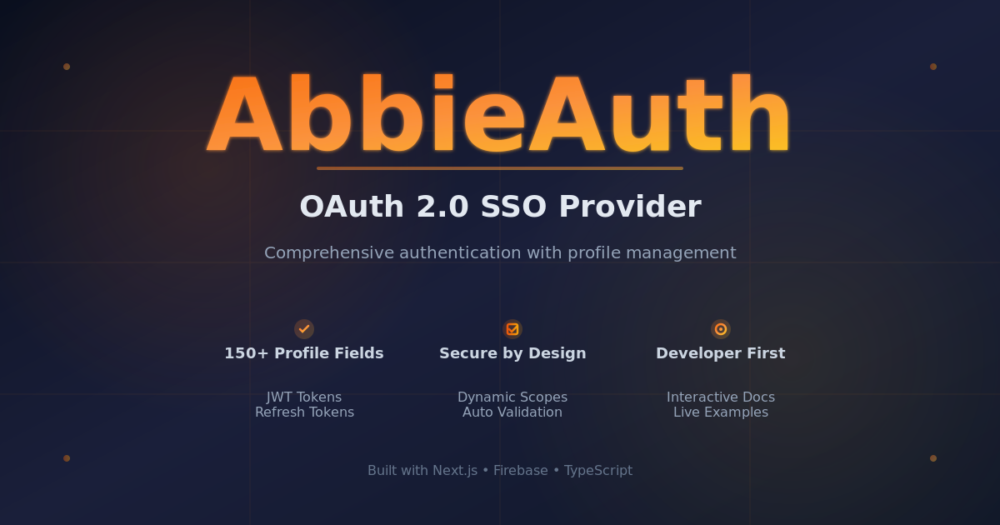

# AbbieAuth



**AbbieAuth** is a comprehensive OAuth 2.0 Single Sign-On (SSO) provider that enables secure authentication and extensive profile management. Built for developers who need a robust authentication solution and users who want to manage their personal information in one centralized location.

**Live Service:** [https://abbieauth.vercel.app](https://abbieauth.vercel.app)

**Documentation:** [https://abbieauth.vercel.app/docs](https://abbieauth.vercel.app/docs)

## Overview

AbbieAuth provides enterprise-grade authentication infrastructure with an extensive profile system supporting 150+ data fields across 13 categories. Whether you're building a new application or integrating authentication into an existing system, AbbieAuth offers a complete solution with minimal setup.

## Key Features

### For Developers

**OAuth 2.0 Compliance**
- Full OAuth 2.0 authorization code flow implementation
- JWT-based access tokens with 1-hour expiry
- Refresh tokens with 30-day validity and revocation support
- Secure client credentials with SHA-256 hashing
- Single-use authorization codes with 10-minute expiry

**Dynamic Scope System**
- 150+ granular scopes for precise data access control
- Automatic scope generation from profile fields
- Interactive scope selector in documentation
- Real-time consent management

**Developer Experience**
- Interactive API documentation with live examples
- Copy-paste ready code snippets
- Personalized examples based on your credentials
- RESTful API endpoints
- Comprehensive error handling

**Security First**
- Industry-standard encryption
- Secure session management
- CSRF protection
- Rate limiting
- Audit logging

### For End Users

**Comprehensive Profile Management**
- Single dashboard for all personal information
- 150+ profile fields across 13 categories
- Secure data storage with Firebase
- Easy profile updates
- Data portability

**Privacy Control**
- Granular consent management
- View and revoke app permissions
- Control what data each app can access
- Transparent data usage

## Profile Categories

AbbieAuth supports extensive profile data organization:

**Basic Information**
Name, date of birth, place of birth, preferred name, nickname, titles, and more

**Demographics**
Gender, pronouns, ethnicity, race, religion, languages spoken, primary language

**Contact Information**
Multiple email addresses, phone numbers (primary, secondary, work), physical address, mailing address

**Identity & Documents**
Nationality, citizenship, passport details, national ID, SSN, tax ID, driver's license

**Family & Relationships**
Marital status, spouse information, children, parents, siblings, anniversary dates

**Education**
Education history, degrees, field of study, university, graduation year, GPA, certifications, professional licenses

**Employment**
Occupation, company, industry, employment status, job title, department, employee ID, work experience, salary, skills, resume, portfolio

**Financial Information**
Annual income, income source, bank details, IBAN, SWIFT code, credit score, net worth, investment portfolio, cryptocurrency wallets

**Health & Medical**
Blood type, height, weight, allergies, medications, medical conditions, disabilities, health insurance, primary physician, organ donor status

**Lifestyle & Preferences**
Smoking status, drinking habits, dietary preferences, hobbies, interests, favorite books/movies/music, pets, vehicles, travel preferences

**Social & Online Presence**
Personal website, blog, LinkedIn, Twitter, Facebook, Instagram, GitHub, YouTube, TikTok, Discord, Telegram, WhatsApp

**Legal & Compliance**
Criminal record, military service details, veteran status, security clearance, political affiliation, voter registration

**Emergency Information**
Primary and secondary emergency contacts with full details (name, phone, relationship, email)

## Integration Guide

### 1. Register Your Application

Visit [https://abbieauth.vercel.app/apps/new](https://abbieauth.vercel.app/apps/new) to register your application. You'll receive:
- Client ID
- Client Secret
- Ability to configure redirect URIs

### 2. Implement OAuth Flow

**Step 1: Redirect users to authorization endpoint**

```
https://abbieauth.vercel.app/oauth/consent?client_id=YOUR_CLIENT_ID&redirect_uri=YOUR_REDIRECT_URI&response_type=code&scope=profile:email profile:name&state=RANDOM_STATE
```

**Step 2: Exchange authorization code for tokens**

```bash
POST https://abbieauth.vercel.app/api/oauth/token
Content-Type: application/json

{
  "grant_type": "authorization_code",
  "code": "AUTHORIZATION_CODE",
  "client_id": "YOUR_CLIENT_ID",
  "client_secret": "YOUR_CLIENT_SECRET",
  "redirect_uri": "YOUR_REDIRECT_URI"
}
```

**Step 3: Access user data**

```bash
GET https://abbieauth.vercel.app/api/oauth/userinfo
Authorization: Bearer ACCESS_TOKEN
```

### 3. Select Required Scopes

Use the interactive scope selector at [https://abbieauth.vercel.app/docs](https://abbieauth.vercel.app/docs) to:
- Browse all available scopes by category
- Select only the data your application needs
- Generate authorization URLs with selected scopes
- Copy implementation examples

## API Endpoints

**Authorization**
```
GET /oauth/consent
```
User authorization and consent page

**Token Exchange**
```
POST /api/oauth/token
```
Exchange authorization code for access and refresh tokens

**Token Refresh**
```
POST /api/oauth/token
```
Refresh expired access tokens using refresh token

**User Information**
```
GET /api/oauth/userinfo
```
Retrieve user data based on granted scopes

**App Management**
```
GET /api/oauth/apps
POST /api/oauth/apps
GET /api/oauth/apps/:id
PATCH /api/oauth/apps/:id
DELETE /api/oauth/apps/:id
```
Manage OAuth applications

## Token Specifications

**Access Tokens**
- Format: JWT (JSON Web Token)
- Expiry: 1 hour
- Usage: Include in Authorization header as Bearer token
- Signing: HMAC SHA-256

**Refresh Tokens**
- Format: Opaque string
- Expiry: 30 days
- Usage: Exchange for new access tokens
- Revocable: Can be revoked by user or application

**Authorization Codes**
- Single-use only
- Expiry: 10 minutes
- Automatically invalidated after token exchange

## Scope Format

All scopes follow the pattern `profile:fieldName`:

```
profile:email          (Required - always included)
profile:name
profile:phone
profile:dateOfBirth
profile:address
profile:occupation
...and 145+ more
```

## Use Cases

**For SaaS Applications**
Implement secure user authentication without building your own auth system

**For Mobile Apps**
Provide social login functionality with extensive profile data

**For Enterprise Systems**
Centralize employee authentication across multiple internal applications

**For Personal Data Management**
Give users a single place to manage all their personal information

**For Compliance**
Meet data privacy requirements with granular consent management

## Security Features

- OAuth 2.0 standard compliance
- HTTPS-only communication
- Secure credential storage
- Token-based authentication
- Refresh token rotation
- Authorization code PKCE support
- Rate limiting on all endpoints
- Comprehensive audit logging
- CSRF protection
- XSS prevention

## Data Privacy

- Users control what data to share
- Granular permission system
- Transparent data access
- Easy permission revocation
- No data selling or sharing
- GDPR-compliant data handling
- Right to data portability
- Right to be forgotten

## Support

For questions, issues, or feature requests:
- Documentation: [https://abbieauth.vercel.app/docs](https://abbieauth.vercel.app/docs)
- Live Examples: Available in interactive documentation
- API Reference: Complete endpoint documentation with examples

## Technology Stack

Built with modern, reliable technologies:
- Next.js 16 for frontend and API routes
- Firebase for authentication and data storage
- TypeScript for type safety
- Zod for runtime validation
- JWT for secure token management

## Getting Started

1. Visit [https://abbieauth.vercel.app](https://abbieauth.vercel.app)
2. Create an account
3. Register your application at [/apps/new](https://abbieauth.vercel.app/apps/new)
4. Follow the integration guide in [documentation](https://abbieauth.vercel.app/docs)
5. Start authenticating users

## License

Copyright (c) 2025 theabbie. Licensed under the MIT License.